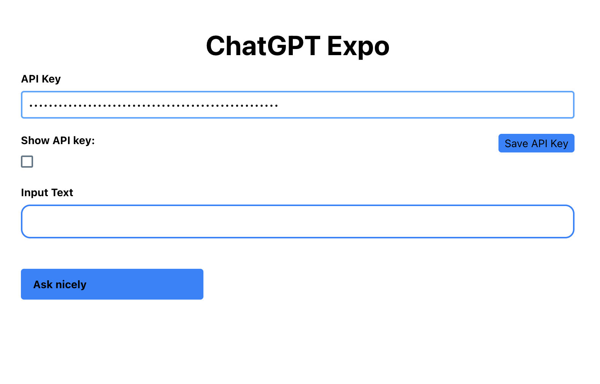

# ChatGPT Expo Project ✨

An Expo Project implementation to interact with ChatGPT API from OpenAI.

Web and iOS are functional. No guarantees.

This is a lift and shift from [tohrxyz/chatgpt-open-ui](https://github.com/tohrxyz/chatgpt-open-ui) 🙌



# 📚 Stack

-   React.js
-   NativeWind
-   Expo project

# 👩🏻‍💻 Run locally

```bash
npm install
npx tailwindcss -i ./src/input.css -o ./public/dist/output.css
npm start
```

# 📄 License

This project is licensed under [MIT License](https://github.com/tohrxyz/chatgpt-open-ui/blob/main/LICENSE)
